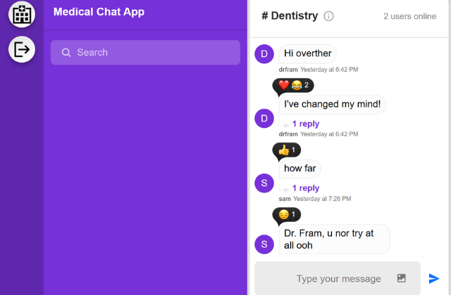

# Medical Chat App

## Overview

Welcome to the Medical Chat App, a full-stack application that facilitates communication in a medical context. This application allows medical professionals to securely chat with each other and provides a platform for collaborative discussions.

## Features

- **Secure Communication:** Messages are encrypted to ensure the confidentiality of medical discussions.
- **User Authentication:** Users can securely log in to access their personalized chat experience.
- **Real-time Chat:** Utilizing Stream Chat, the app enables real-time communication between medical professionals.
- **Twilio Integration:** Integrated Twilio for SMS notifications to ensure important messages are not missed.
- **Easy Deployment:** Deploy effortlessly with Nodemon for automatic server restarts during development.

## Client-Side Technologies

- React
- Stream Chat React for interactive chat components
- Axios for HTTP requests
- Universal Cookie for managing cookies
- Web Vitals for tracking performance metrics

## Server-Side Technologies

- Express for building the server
- Bcrypt for secure password hashing
- CORS for handling Cross-Origin Resource Sharing
- Crypto for cryptographic functionalities
- Dotenv for environment variable management
- GetStream for server-side implementation of Stream Chat
- Nodemon for automatic server restarts during development
- Twilio for SMS notifications

## Getting Started

### Client

1. Clone the client repository: `git clone https://github.com/dezmanvee/medical__chat__app.git`
2. Navigate to the client directory: `cd client`
3. Install dependencies: `npm install`
4. Run the client: `npm start`

### Server

1. Clone the server repository: `git clone https://github.com/dezmanvee/medical__chat__app.git`
2. Navigate to the server directory: `cd server`
3. Install dependencies: `npm install`
4. Run the server: `npm start`

## Usage

1. Visit the client application at http://localhost:3000.
2. Log in with your credentials or create a new account.
3. Start chatting with medical professionals in real-time.

## Contact

For any inquiries or support, please contact me at bamyonline@gmail.com

